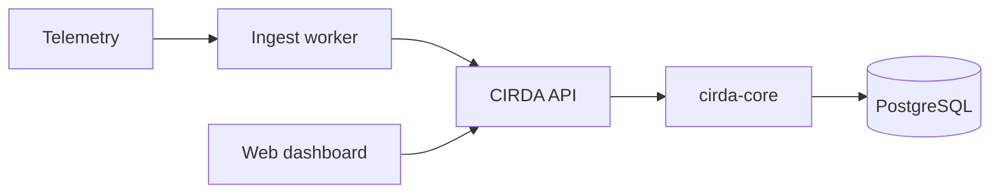

# Architecture Overview

CIRDA (Coverage-Informed Retirement Decision Analysis) is a control plane for
evaluating whether AI agent estate changes — especially retirement — are safe
given observability coverage and inferred dependency structure.

## Goals

1. **Never false-SAFE under low coverage** — C < C_min yields INDETERMINATE, not SAFE.
2. **Explainable decisions** — every verdict includes rationale, coverage, and limitations.
3. **Temporal fidelity** — evidence decays; stale edges lose confidence but remain auditable.
4. **Paper-aligned core** — fusion, layering, and tri-state gate match published claims.

## Documents

| Doc | Topic |
|-----|-------|
| [01-pipeline.md](01-pipeline.md) | Ingest, fusion, gate pipeline |
| [02-data-model.md](02-data-model.md) | Entities, edges, layers |
| [03-confidence-model.md](03-confidence-model.md) | Fusion equations, θ_c / θ_p |
| [04-coverage-estimation.md](04-coverage-estimation.md) | C, benchmark mode, gate interaction |
| [05-security-model.md](05-security-model.md) | Auth, RBAC, network boundaries |

## System context

## Benchmark harness

`packages/cirda-bench` runs a faithful simulator (no metric overlay) against golden
Table II. See `CALIBRATION.md` in that package.
